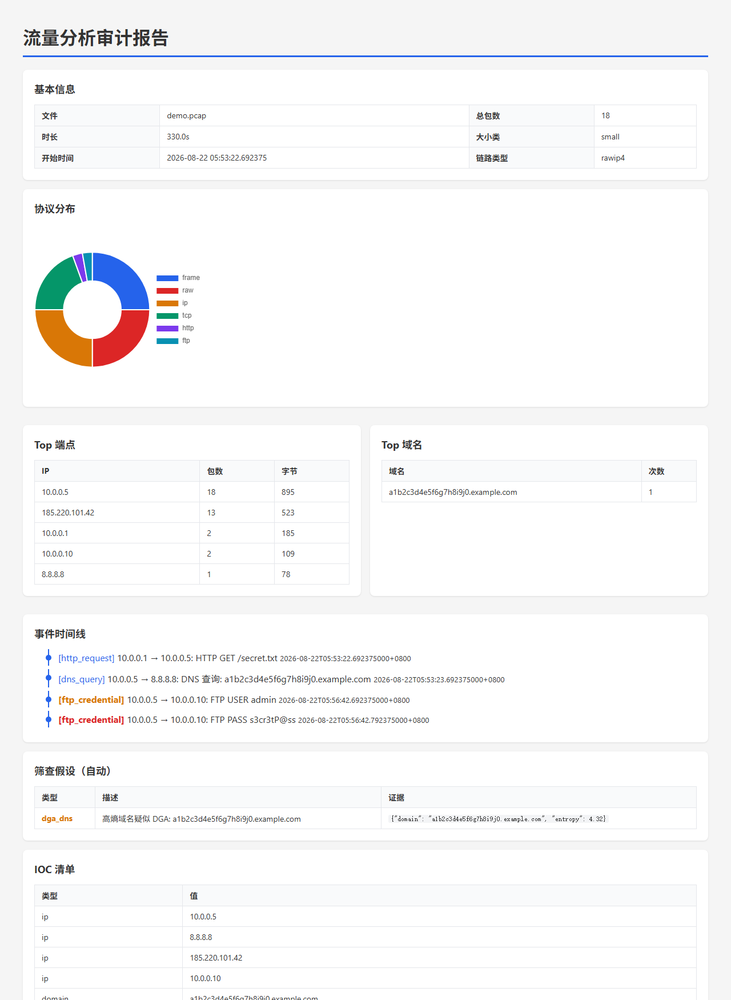
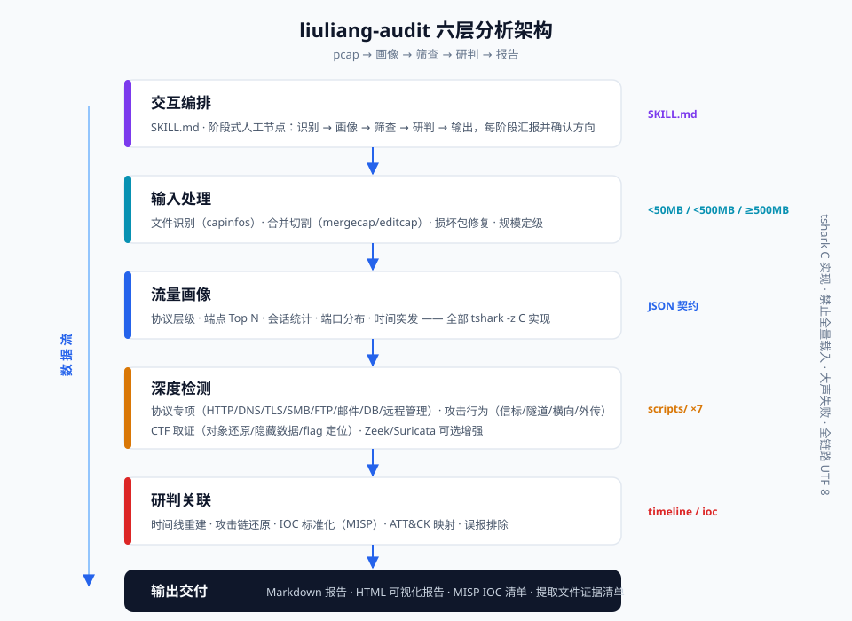

<div align="center">

# liuliang-audit

**专业流量分析审计 Skill — 对 pcap 流量包进行全类型分析、筛查与研判**

[](https://github.com/chu0119/liuliang-audit/actions/workflows/ci.yml)


*安全攻防 · 应急响应 · CTF 流量取证 — 一句话触发，五阶段研判，报告一键交付*

[快速开始](#-快速开始) · [功能详解](#-功能详解) · [演示](#-演示) · [架构](#-架构) · [FAQ](#-faq)

</div>

---

## 📖 简介

`liuliang-audit` 是一个面向专业安全人士的**流量分析审计技能（Skill）**，运行于 AI Agent 环境。给它一个 pcap 流量包，它会以**五阶段工作流**（识别 → 画像 → 筛查 → 研判 → 输出）完成全类型分析：协议画像、攻击行为检测、C2 信标识别、文件取证、IOC 提取、攻击链还原，最终交付 **Markdown 报告 + 自包含 HTML 可视化报告 + MISP 格式 IOC 清单**。

与"跑一个脚本出一份日志"的工具不同，它是**阶段式人工节点**设计：每个阶段结束汇报发现、给出下一步选项，由分析师拍板方向——AI 负责跑腿和计算，研判权始终在你手里。

| 场景 | 重心 | 报告模板 |
|------|------|----------|
| 🚩 **CTF 流量取证** | 文件还原、隐藏数据、flag 定位、畸形协议 | `report_ctf.md` |
| 🚨 **应急响应** | 时效、恶意行为检测、IOC 提取、溯源链还原 | `report_ir.md` |
| 🎯 **攻防演练复盘** | 攻击路径分析、检测盲区、TTP 关联 | `report_attackdef.md` |

## ✨ 核心特性

- **🔍 全协议深挖** — HTTP / DNS / TLS(JA3/SNI/证书) / SMB / FTP / 邮件 / MySQL·MSSQL·Redis / RDP·SSH·WinRM
- **🛡️ 攻击行为检测** — 端口扫描、登录爆破、Webshell 流量、C2 信标（间隔+抖动统计）、DNS/ICMP 隧道、横向移动、数据外传
- **🧬 CTF 取证专项** — HTTP/SMB/TFTP 对象还原、图片尾部与协议字段隐写、Base64/Hex 解码、flag 格式全局搜索、明文凭据提取
- **📊 可视化报告** — 自包含单文件 HTML：协议环形图、彩色事件时间线、IOC 清单、筛查假设表，浏览器直接打开
- **📦 证据链完备** — 提取文件 SHA-256 固定、事件按时间排序、IOC 输出 MISP CSV 可直接导入情报平台
- **📐 规模自适应** — <50MB 全量深析 / <500MB 画像后过滤 / ≥500MB 自动时间切片，GB 级包不爆内存
- **🔌 引擎可选增强** — 检测到 Zeek/Suricata 自动启用 IDS 特征检测，未装优雅降级 tshark 规则化检测
- **🗣️ 大声失败** — 工具故障立即报错（含 stderr 摘要），绝不把"工具坏了"伪装成"没有数据"
- **🪟 Windows 友好** — 全链路 UTF-8，GBK 控制台管道不乱码

## 🖼️ 演示

以下演示全部基于仓库内置的**合成流量包**（`docs/demo/demo.pcap`，含 HTTP 下载、DGA 域名、C2 信标、ICMP 隧道、明文 FTP 凭据五类要素），可自行复现。

**HTML 可视化报告**（`docs/demo/report-demo.html`，浏览器直接打开）：



**信标检测** — 10 次 SYN 精确 30s 间隔、0% 抖动，判定 `LIKELY_BEACON`：

```json
[
  {
    "dst": "185.220.101.42:443",
    "count": 10,
    "avg_interval": 30.0,
    "stdev": 0.0,
    "jitter_pct": 0.0,
    "verdict": "LIKELY_BEACON"
  }
]
```

**DGA 域名识别** — 子域名熵 4.32 > 阈值 3.5：

```json
[
  {
    "domain": "a1b2c3d4e5f6g7h8i9j0.example.com",
    "subdomain": "a1b2c3d4e5f6g7h8i9j0",
    "entropy": 4.32,
    "verdict": "HIGH_ENTROPY"
  }
]
```

**IOC 标准化输出**（可直接导入 MISP / 微步 / FOFA 等）：

```json
{
  "ips": ["10.0.0.5", "8.8.8.8", "185.220.101.42", "10.0.0.10"],
  "domains": ["a1b2c3d4e5f6g7h8i9j0.example.com"],
  "urls": ["http://evil.com/secret.txt"]
}
```

复现方式：

```bash
cd liuliang-audit
python scripts/pcap_profile.py docs/demo/demo.pcap      # 画像
python scripts/beacon_detect.py docs/demo/demo.pcap     # 信标检测
python scripts/html_report.py docs/demo/demo.pcap demo.html   # 可视化报告
```

## 🏗️ 架构



**设计原则**：所有统计走 tshark C 实现、Python 仅做聚合（禁止全量载入内存）；工具失败大声报错；全链路 UTF-8；脚本零共享依赖可独立运行。

## 🧰 功能详解

### 7 个分析脚本

| 脚本 | 功能 | 检测原理 |
|------|------|----------|
| `pcap_profile.py` | 一键画像 → 标准化 JSON（**核心契约**） | capinfos 元信息 + `tshark -z` 协议层级/端点/会话/DNS 树；自动生成筛查假设（高熵域名→DGA 等） |
| `beacon_detect.py` | C2 信标检测 | 按目的 IP:port 分组 SYN 时间戳，间隔均值 + 抖动百分比；10s–1h 且抖动 <30% 判定 `LIKELY_BEACON` |
| `entropy_dns.py` | DNS 熵分析 / DGA 检测 | 香农熵 >3.5 且子域名长度 >10 判定 `HIGH_ENTROPY`（DGA 典型特征） |
| `extract_files.py` | 文件取证 | `tshark --export-objects`（HTTP/SMB/TFTP）+ SHA-256 固定；自动清理陈旧目录防错误归因 |
| `ioc_extract.py` | IOC 提取标准化 | 多协议字段提取（ip.dst / dns.qry.name / http.host+uri / tls.handshake.ja3 / user_agent），MISP CSV 导出 |
| `timeline_builder.py` | 事件时间线 | DNS/HTTP/FTP 事件按 `frame.time_epoch` 数值排序，severity 分级（info/medium/high） |
| `html_report.py` | HTML 可视化报告 | 模板占位符单遍替换；Chart.js 环形图（SRI 校验）；时间线/IOC 截断提示；模板漂移守卫 |

### 检测能力清单

<details>
<summary><b>攻击行为检测（点击展开）</b></summary>

| 行为 | 判定逻辑 | ATT&CK |
|------|----------|--------|
| C2 信标 | SYN 间隔 10s–1h，抖动 <30% | T1071.001 |
| DGA 域名 | 子域名熵 >3.5 且长度 >10 | T1568.002 |
| DNS 隧道 | TXT 响应 >100B / 高熵子域名 | T1071.004 |
| ICMP 隧道 | payload 非标准模式 | T1095 |
| 端口扫描 | 单源 >20 目标端口 SYN | T1046 |
| 登录爆破 | 单源对单目标 >10 次失败/分钟 | T1110 |
| 横向移动 | SMB Trans / Kerberos / WinRM 5985-6 | T1021 |
| 数据外传 | 出站流量 > 基线 3σ / 非业务端口大流量 | T1041 |
| Webshell | POST 含 eval/base64_decode/system + 响应含命令输出 | T1505.003 |
| 明文凭据 | FTP USER/PASS / HTTP Basic / SMTP AUTH | T1552.001 |

</details>

<details>
<summary><b>协议专项分析（点击展开）</b></summary>

- **HTTP**：请求/响应还原、对象导出、webshell 特征、可疑 UA/URI
- **DNS**：查询树、TXT 记录、NXDOMAIN 分布、DGA/隧道
- **TLS**：SNI、JA3/JA3S 指纹、证书 SAN/序列号/自签检测
- **SMB**：命令分布、文件操作路径、横向行为
- **FTP/Telnet**：明文凭据、命令序列
- **邮件**（SMTP/POP3/IMAP）：账号、附件线索
- **数据库**（MySQL/MSSQL/Redis）：未授权访问、敏感查询
- **远程管理**（RDP/SSH/WinRM）：会话与爆破

</details>

### 五阶段工作流

```
阶段 0 · 识别   capinfos 元信息 / 规模定级 / 场景初判        → 分析师确认方向
阶段 1 · 画像   协议·端点·会话·时间统计 → 生成筛查假设清单    → 分析师选优先级
阶段 2 · 筛查   信标检测/DGA/对象提取/协议深挖（多轮循环）     → 每条假设给"证实/排除/存疑"
阶段 3 · 研判   时间线重建/攻击链还原/IOC/ATT&CK/误报排除     → 分析师确认结论
阶段 4 · 输出   MD 报告 + HTML 可视化 + MISP IOC 清单
```

## 🚀 快速开始

### 前置条件

| 依赖 | 必要性 | 说明 |
|------|--------|------|
| [Wireshark 套件](https://www.wireshark.org/)（tshark/capinfos/editcap/mergecap） | **必装** | 核心分析引擎 |
| Python 3.9+ | 必装 | 分析脚本仅用标准库 |
| scapy / pyshark | 可选 | 测试与增强解析，缺失不阻塞 |
| Zeek / Suricata | 可选 | 已装启用 IDS 检测，未装自动降级 |

### 安装

```bash
git clone https://github.com/chu0119/liuliang-audit.git
cp -r liuliang-audit ~/.claude/skills/liuliang-audit
```

### 使用

对 Claude 说一句话即可触发：

```
分析 D:\case\incident.pcap，应急响应场景
```

```
CTF 流量取证：这个包里藏着 flag，帮我找出来
```

内置触发关键词：流量分析、pcap 分析、流量取证、CTF 流量、应急响应流量、网络取证、packet capture、traffic audit、pcap forensics、流量研判

## 📂 目录结构

```
liuliang-audit/
├── SKILL.md                  # 主入口：触发词 + 场景路由 + 五阶段工作流
├── references/               # 8 个知识库文档
│   ├── 01-pcap-basics.md     #   文件识别 / 切割合并 / 规模自适应
│   ├── 02-traffic-profiling.md  # 画像统计与筛查假设规则
│   ├── 03-protocol-deepdive.md  # 协议专项分析要点
│   ├── 04-attack-detection.md   # 攻击行为检测判定逻辑
│   ├── 05-ctf-forensics.md      # CTF 题型与解题模式
│   ├── 06-incident-response.md  # 研判 / ATT&CK 映射 / 误报排除
│   ├── 07-visualization.md      # HTML 报告设计规范
│   └── 08-ids-engines.md        # Zeek/Suricata 集成与降级
├── scripts/                  # 7 个独立分析脚本（见功能详解）
├── templates/                # 3 套场景报告模板 + MISP CSV + HTML 模板
├── examples/                 # CTF HTTP 题完整走查范例
├── tests/                    # 71 个测试（单元 + 真实 tshark 集成 + 端到端）
└── docs/
    ├── assets/               # 架构图 / 演示截图
    └── demo/                 # 合成演示流量包 + 全流程真实输出
```

## 🧪 测试与质量

```bash
cd liuliang-audit
python -m pytest tests/ -v    # 71 个测试
```

- 测试数据由 scapy 动态构造（五类流量要素），无外部样本依赖
- 集成测试跑**真实 tshark**，端到端测试验证七脚本全链路数据贯通
- GitHub Actions CI：每次 push 自动在 Ubuntu + tshark 环境跑全套

## ❓ FAQ

<details>
<summary><b>支持多大文件？会内存爆炸吗？</b></summary>

不会。所有统计走 tshark C 实现（流式），Python 只聚合结果。≥500MB 自动走 editcap 时间切片分批处理。
</details>

<details>
<summary><b>没装 Zeek/Suricata 能用吗？</b></summary>

能。两者均为可选增强：未安装时自动降级为 tshark 规则化检测（信标/熵分析/扫描/爆破等核心能力不受影响），报告会标注"IDS 引擎未启用"。
</details>

<details>
<summary><b>加密流量（TLS）能分析什么？</b></summary>

无需解密即可提取：SNI 域名、JA3/JA3S 指纹、证书链信息、流量时序与包长特征——这些足以支撑 C2 识别与信标检测。本 Skill 不做 TLS 解密；若你持有密钥可先在 Wireshark 中解密再分析。
</details>

<details>
<summary><b>Windows 下中文乱码？</b></summary>

已处理：全链路强制 UTF-8，CLI 入口对 stdout 做 reconfigure，GBK 控制台管道下有专门测试覆盖。
</details>

<details>
<summary><b>和直接用 Wireshark 有什么区别？</b></summary>

Wireshark 是交互式手工分析工具；liuliang-audit 把专业分析流程（假设生成 → 定向筛查 → 研判 → 报告）编排成可复现的自动化流水线，且产出标准化报告与 IOC。两者互补——深挖单流时仍可用 Wireshark。
</details>

## 🗺️ Roadmap

- [ ] beacon_detect 结果自动并入画像假设（HTML 报告直接呈现信标发现）
- [ ] 会话关系拓扑图（sankey）
- [ ] GeoIP 地理标注（可选离线库）
- [ ] 威胁情报平台联动（微步 / VirusTotal API 富化 IOC）
- [ ] Zeek 日志深度消费（conn.log/files.log 关联分析）

## 🤝 贡献

欢迎 Issue / PR！请先阅读 [CONTRIBUTING.md](CONTRIBUTING.md)（含项目约定：性能红线、大声失败、TDD 等，PR 审查会检查）。

## 📄 License

[MIT](LICENSE) © 2026 chu0119

---

<div align="center">

**如果这个项目对你有帮助，欢迎点个 Star ⭐**

</div>
